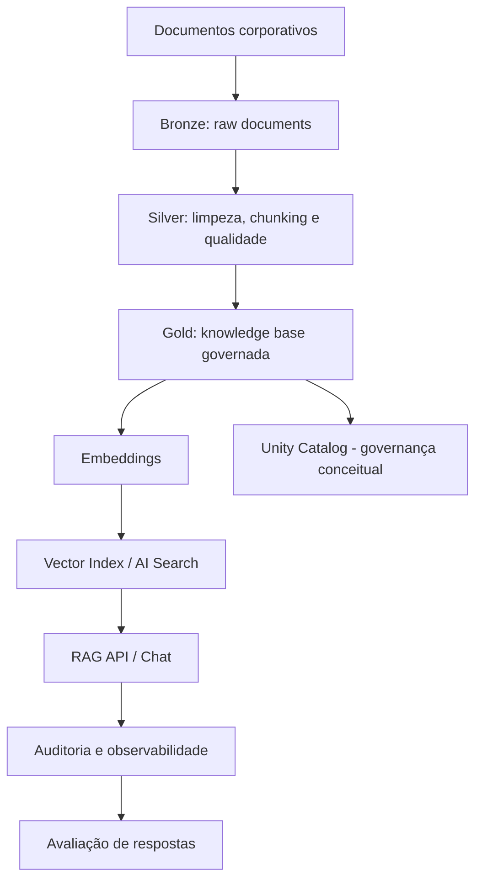

# Diagrama Mermaid

```mermaid
flowchart TD
    A[Documentos corporativos] --> B[Bronze: raw documents]
    B --> C[Silver: limpeza, chunking e qualidade]
    C --> D[Gold: knowledge base governada]
    D --> E[Embeddings]
    E --> F[Vector Index / AI Search]
    F --> G[RAG API / Chat]
    G --> H[Auditoria e observabilidade]
    D --> I[Unity Catalog - governança conceitual]
    H --> J[Avaliação de respostas]
```
